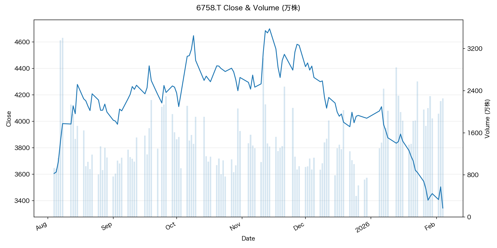
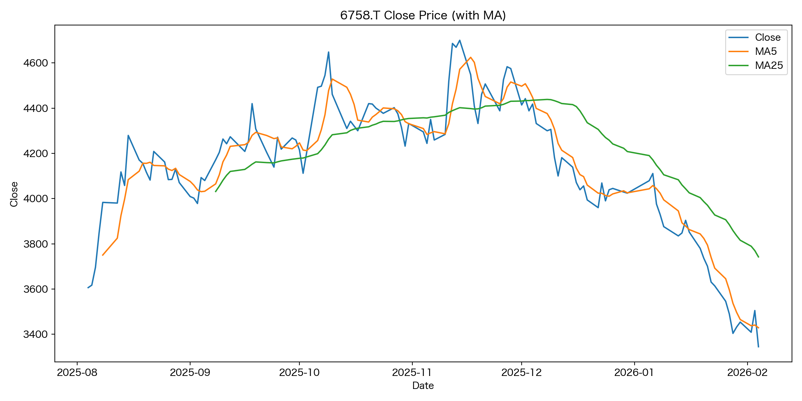

# stock_price_auto_report

株価データを取得し、CSVとグラフを自動生成するCLIツールです。

## できること
- yfinance を使って株価（終値）と出来高を取得
- 日次 / 週次データを CSV として保存
- 終値 + 移動平均（MA5 / MA25）のグラフを自動生成
- 終値 × 出来高の2軸グラフ（万株 / 億株表示）を自動生成
- --latest 指定で常に最新結果を `output/latest` に固定

## サンプル出力

### 終値 × 出来高（2軸グラフ）


> 終値と出来高を2軸で可視化。  
> 出来高は万株 / 億株に自動換算し、日付は見やすく自動調整。

### 終値 + 移動平均（MA5 / MA25）


短期・中期トレンドを把握するための移動平均を重ねて表示。

---

## セットアップ

```bash
# リポジトリを取得
git clone https://github.com/atk-128/stock_price_auto_report.git
cd stock_price_auto_report

# 仮想環境（推奨）
python3 -m venv .venv
source .venv/bin/activate

# 依存関係をインストール
pip install -r requirements.txt

# 単体銘柄
python3 main.py --tickers 7203.T

# 複数銘柄
python3 main.py --tickers 7203.T,6758.T,9984.T

# 期間・足種別指定
python3 main.py \
  --tickers 7203.T,6758.T \
  --period 6mo \
  --interval 1d

# 実行名を付ける
python3 main.py \
  --tickers 7203.T,6758.T \
  --run-name my_test_run

# latest を更新
python3 main.py \
  --tickers 7203.T,6758.T \
  --latest

## CLIオプション一覧

## 出力例

### 終値 × 出来高（2軸グラフ）


### 終値 + 移動平均（MA5 / MA25）


### price_volume.png
- **終値（線） × 出来高（棒）** の2軸グラフ  
- 出来高は **万株 / 億株** に自動変換  
- 日付は自動間引きで視認性を確保

### summary.csv
- 最新日の OHLC / 出来高を1行で出力

### price_history.csv
- 取得した全期間の価格データ（CSV）

### run_result.csv
- 実行した銘柄ごとの成功 / 失敗ステータス一覧

| オプション | 説明 |
|-----------|------|
| --tickers | ティッカー（カンマ区切り） |
| --period | 取得期間（例: 1mo, 6mo, 1y） |
| --interval | 足種別（1d, 1wk, 1mo） |
| --run-name | 実行名（フォルダ名に反映） |
| --latest | latest フォルダを更新 |

## 想定用途
- 個人投資家の **日次・週次の簡易株価分析**
- 株価データ取得〜可視化までの **Python自動化サンプル**
- CLIツール設計・データ可視化の **ポートフォリオ用途**